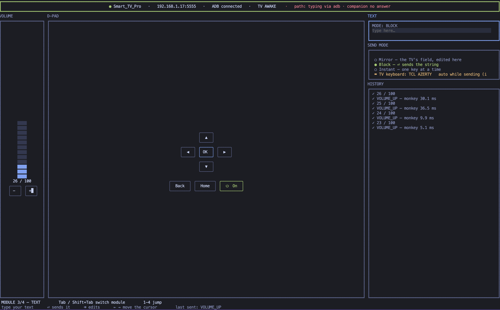

<div align="center">

# zapette

**A remote control for your Android TV that lives in your terminal — built so that typing on a TV stops hurting.**

Text lands in the TV's own box in **66 ms** instead of 2.2 s.
Keys answer in **2.7 ms** instead of 1238 ms.

[](https://github.com/voidshaman/zapette/actions/workflows/test.yml)
[](https://github.com/voidshaman/zapette/actions/workflows/companion-apk.yml)
[](LICENSE)

[Features](#features) · [Install](#install) · [Usage](#usage) · [Why it is fast](#why-it-is-fast) · [FAQ](#faq) · [Docs](#docs)

</div>



<sub>Driving a real TV over Wi-Fi. No TV handy? `./run.sh --demo` drives the whole interface offline.</sub>

## Features

- **Type with a real keyboard.** Searching YouTube or signing into an app no longer means
  arrow-keying across an on-screen keyboard. zapette shows you the same text the TV has in its box —
  edit it on your computer and the TV follows along.
- **It speaks your TV's language.** It reads the TV's keyboard layout when it connects and adjusts —
  so on a French AZERTY set, the letters you press are the letters that appear.
- **Every button a remote has.** Arrows, OK, Back, Home, volume, power — all from your keyboard,
  all instant, each one logged with the time it took.
- **Launch and manage apps.** See everything the TV can open and everything it's running, start or
  stop any of it, and install new apps from files on your computer.
- **Wake it up, put it to sleep.** Turn the TV on from your desk — it can wake the set over the
  network — and send it back to sleep when you're done.
- **A mouse when you need one.** Some apps insist on taps; hand your computer's mouse to a pointer
  on the TV and click away.
- **Nothing to install on the TV.** It works out of the box with the debugging interface already
  built into Android TV. The first time it meets your TV it asks before touching anything, and an
  optional companion app — which only your computer can talk to — makes it faster still.
- **Runs anywhere.** macOS, Linux and Windows. One download, nothing else to install.

## Install

**From a release** — grab the download for your platform from [Releases](../../releases). That's the
whole install: no Node, no npm, nothing else.

**From source**

```sh
git clone https://github.com/voidshaman/zapette
cd zapette
npm install
./run.sh
```

**Either way, ADB has to be enabled for full functionality.** Every part of Zapette — keys, text, the
app list, volume, power — reaches the TV over ADB, so this is not an optional extra: with wireless
debugging off, the app finds no devices at all. Turn it on once in *Settings → Developer options → ADB
over network*, and accept the debugging prompt on the TV the first time this machine connects. A
release binary carries its own adb, so there is nothing to install on your machine — the switch on the
TV is the part that matters.

## Usage

```sh
./run.sh          # pick your TV from the list, and you're driving
./run.sh --auto   # skip the list, use the first TV found
./run.sh --demo   # no TV: try the whole interface offline
```

| You want to… | Do this |
|---|---|
| Move around the TV | Arrow keys, `Enter` for OK, `Backspace` for Back |
| Type into a search box | Press `3`, type, `Enter` |
| Change the volume | Press `2`, then `↑` `↓` |
| Open or close an app | Press `l`, pick it, `Enter` |
| Wake / sleep the TV | `w` / `s` |

<details>
<summary><b>Every key</b></summary>

| key | does |
|---|---|
| `Tab` / `Shift+Tab` | switch panel (works from inside the text box) |
| `1` `2` `3` `4` | jump to D-pad / Volume / Text / Send mode |
| arrows, `Enter`, `Backspace`/`b`, `h` | drive the TV: direction, OK, Back, Home |
| `↑` `↓` or `−` `+` | volume, in the Volume panel |
| `w` / `s` / `p` | wake / sleep / power |
| `l` | app list and task manager |
| `i` | install an app file (opens a file picker) |
| `c` | check on the companion app |
| `m` | mouse mode |
| `d` | pick a different TV |
| `Esc` | leave a screen or release the mouse |

While the text box has focus the keyboard belongs to it, so no shortcut can fire — `Tab` still gets
you out.

</details>

## Why it is fast

| path | cost |
|---|---|
| text, companion route | **66 ms** per send (415 ms on the first, which selects the IME) |
| text, adb route | 2.2 s |
| keys, monkey socket | **2.7 ms** best / 8.9 ms median |
| keys, `adb shell input keyevent` | 1238 ms |
| companion ping, via `adb forward` | 8.4 ms |

Plain `adb shell input` starts a JVM on the TV for every call, which is why a naive remote feels like
typing through mud. Two things avoid it: a long-lived `monkey` socket for keys, and the companion's own
IME for text, which commits a whole string in one call. Both are additive — pull either away and the
app degrades to plain adb instead of breaking.

<sub>Every number above was measured on a real set, not estimated — the raw runs are in
[HANDOFF.md](HANDOFF.md).</sub>

## FAQ

<details>
<summary>Does it need root, or anything installed on the TV?</summary>

No. It works with what every Android TV already has. The optional companion app makes typing and
keys faster, but everything works without it.
</details>

<details>
<summary>Why does my TV show the wrong letters, or swallow repeated ones?</summary>

With other tools, that happens because they type as if every TV had a US keyboard. zapette reads
your TV's actual keyboard layout when it connects and adjusts — so it shouldn't happen here. The
long version is in [docs/typing.md](docs/typing.md).
</details>

<details>
<summary>Can someone else on my network drive my TV through this?</summary>

No. The companion app only answers the computer it was set up with, and proves it on every
connection.
</details>

<details>
<summary>My TV keeps falling asleep on its own.</summary>

That's the TV's own power saving, not zapette. Switch on "networked standby" in the TV's settings
and `w` will wake it back up over the network.
</details>

## Docs

| | |
|---|---|
| [docs/typing.md](docs/typing.md) | the TV's own keyboard, AZERTY, characters it eats, mirror mode and carets |
| [docs/latency.md](docs/latency.md) | why batching exists, how the monkey socket works, power timings |
| [docs/companion.md](docs/companion.md) | the companion app, its security model, the first-connect setup |
| [docs/apps.md](docs/apps.md) | app list, task manager, app installer, device history |
| [docs/build.md](docs/build.md) | standalone binaries, cross-building, per-platform notes |
| [HANDOFF.md](HANDOFF.md) | working state and the raw measurements |

## Built on

- [OpenTUI](https://github.com/sst/opentui) — the terminal UI framework behind every panel on screen,
  and the project's only npm dependency.
- [Android platform-tools](https://developer.android.com/tools/releases/platform-tools) — `adb` does
  all the talking to the TV; the release downloads bundle it unmodified (Apache-2.0).
- [Bun](https://bun.sh) — compiles the standalone executables.
- [Node.js](https://nodejs.org) — the runtime when running from source.

## Licence

**GPL-3.0-only.** The bundled adb is Apache-2.0 (see [`assets/NOTICE.txt`](assets/NOTICE.txt)), which
is compatible with GPLv3.
